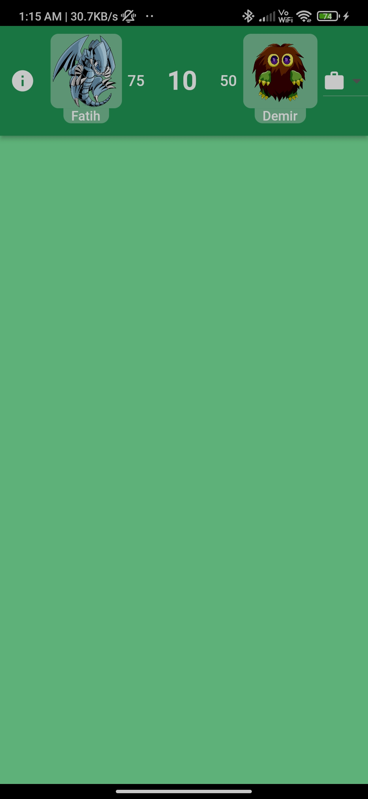
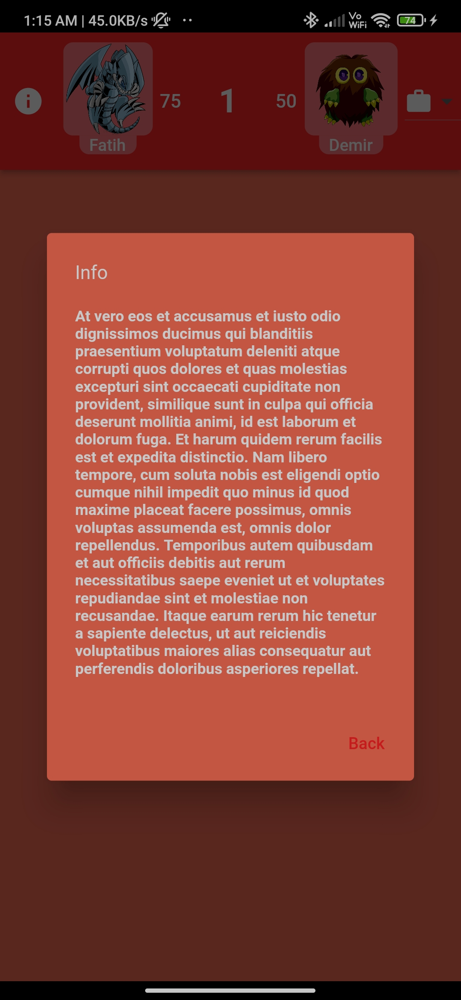
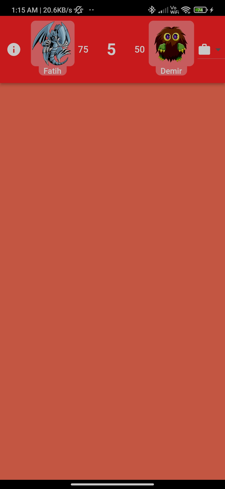
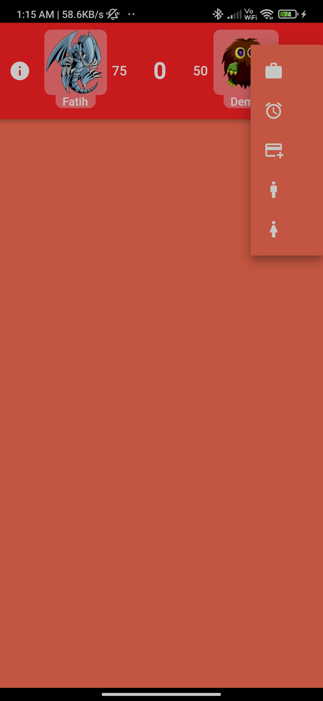

# VBT Case
## Screenshots

    

1-) Ana ekran üzerinde bir buton olsun ve tıklandığı zaman oyun sayfasına yönlendirsin ve kullanıcı geri dönüş yapamasın.
2-) Oyun sayfası içerisinde bulunan Appbar ortasında iki oyuncunun profil fotoğrafı, adı, anlık skor, ve 15 sn den geri sayım yapan zaman göstergesi istiyoruz.
3-) Zaman göstergesi 15 sn geri sayım yaparken 5 sn ve altına inince arka plan rengi kırmızı olsun haricinde yeşil renkte olmalı.
4-) Oyuncu adları profil resimlerinin altında yer alacak skor ve zaman  göstergesi iki rakip arasında yer alacak.
5-) Appbar sol tarafında info butonu olacak tıklandığı zaman ekranda çıkan dialog içerisinde uzun bir metin yazılı olmasını tercih ederiz.(metnin içeriği önemli değil)
6-) Appbar sağ tarafında dropdown buton istiyoruz tıklandığında 5 adet icon çıkacak içerisinden (kullanılan iconların ne olduğu önemli değil)

# Architecture

* Config-->Navigation ve Theme gibi uygulamanın bütününe hitap eden özelliklerin yapılandırıldığı katman
* Constants-->Uygulama geneline hitap eden sabit değişkenleri içeren katman
* Helpers-->Uygulama genelinde kullanılabilecek sayfa bağımsız methodlar, extensionlar ve dummy dataları içeren katman
* Presentation--->Ekranların ui ve logicini içeren katman

# Packages

* cupertino_icons
* equatable
* device_preview
* flutter_bloc
* provider
* test